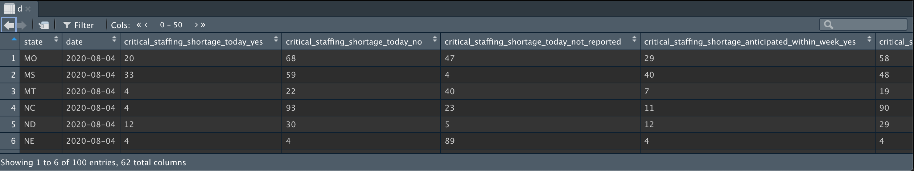
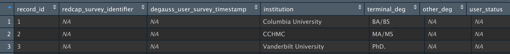

```{r setup, include=FALSE}
options(htmltools.dir.version = FALSE)
```

---

# APIs Overview

- APIs allow programmers to request data directly from certain websites through what's called an Application Programming Interface (https://www.dataquest.io/blog/r-api-tutorial/)

- APIs will have unique URLs and access keys that you will need to access the data

---

# APIs and R (httr)

- It is relatively simple to access APIs in R using either dedicated wrapper packages or manually using the `httr` and `jsonlite` packages

```
library(httr); library(jsonlite); library(tidyverse)

res <- GET("http://cagisonline.hamilton-co.org/arcgis/rest/services/COUNTYWIDE/CagisCoreLayers/MapServer/3/query?where=1 %3D1&outFields=SHAPE,NEWADDR&outSR=4326&f=json")
dat <- content(res, as = "text", encoding = "UTF-8")
df <- fromJSON(dat, flatten = TRUE) %>%
  data.frame()
df <- df %>%
  filter(!is.na(features.attributes.NEWADDR)) %>%
  select(address = features.attributes.NEWADDR, lon = features.geometry.x, lat = features.geometry.y)
df <- sf::st_as_sf(df, coords = c('lon', 'lat'), crs = 4326)
mapview::mapview(df)

```
---

```{r echo = FALSE}
knitr::include_url("ex_map.html", height="600px")
```


---

# R API Wrapper Packages

combine this with the above ?

---

# tidycensus

erika

---

# tigris

erika

---

# example

erika

---

# HealthData.gov
- Using the package `RSocrata`, you can easily access datasets using a single command

 `df <- read.socrata("https://healthdata.gov/resource/g62h-syeh.json")`

  - This command will import the dataset for Covid-19 Patient Impact and Hospital Capacity by State Timeseries
  



---

# REDCap API 
- You can quickly access your REDCap project data using an api wrapper package called `redcapAPI`

- Using your project-specific API access token and REDCap url, you are able to access your data

  `rcon <- redcapConnection(url = my_url, token = my_token)`
  `dat <- exportRecords(rcon)`

  - It is also possible to specify specific fields and records in the `exportRecords()` function

---

# REDCap Example

- We currently use the `redcapAPI` package to access user experience survey data for DeGAUSS

  `my_url <- c('https://redcap.research.cchmc.org/api/')`
  `my_token <- c('D7...')`

  `options(redcap_api_url = my_url)`<br>
  `rcon <- redcapConnection(url = my_url, token = my_token)`<br>
  `dat <- exportRecords(rcon, labels=F)`<br>
  `write.csv(dat,"survey_raw_data.csv")`
  
  

---

# Creating Your Own API With Plumber

---

# More APIs
- A wrapper packaged for the Google Maps API: `mapsapi` that allows you to pull directions, distances, rasters and geocoded locations (point or polygon)

- Baseball fans can access interesting data using the package `baseballr`
 
  - `baseballr` uses the official MLB stats API and can pull pitch-by-pitch data, as well as source data from various baseball statistics databases
  
- [RapidAPI](https://rapidapi.com/marketplace) is an online repository of thousands of APIs across hundreds of topics
  - Most are free, but generally opensource, so quality and validity can be hard to verify

---

# APIs and Data Privacy

erika

