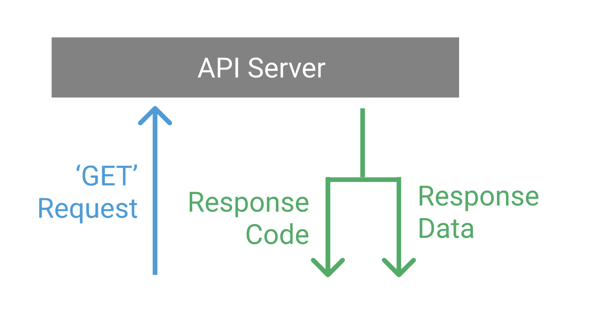

```{r setup, include=FALSE}
options(htmltools.dir.version = FALSE, message = F, warning = F,
        package.startup.message = FALSE)
```

# API Overview

- Application Programming Interface

- defines interactions between different software applications

- simplifies programming by abstracting the underlying implementation and only exposing objects or actions the developer needs

---

# APIs and R 

- APIs are often used to request datasets directly from websites instead of downloading them 

- We can think of an API as a computer waiting for data requests. We need to write R code that tells the API what we need.

- The API will read our code, process the request, and return nicely-formatted data that can be easily parsed by existing R libraries

<center>

</center>
---

# APIs and R - `{httr}`

- We can make a `GET` request using the R package `httr`

- The `httr::GET()` function requires a URL - the address of the server that the request needs to be sent to

```{r}
library(httr)
library(jsonlite)
response = httr::GET("http://api.open-notify.org/astros.json")
```

- We get a response back from the API

```{r}
response 
```

---

# APIs and R - `{httr}`

- The actual data is not in a human-usable format.

```{r}
response$content
```

```{r}
fromJSON(rawToChar(response$content))
```

---

# APIs and R - `{httr}`

```{r, echo=F}
fromJSON(rawToChar(response$content))$people
```


---

# R API Wrapper Packages

- Many R wrapper packages have been created to make accessing APIs using R even easier.

- These packages consist of code similar the previous example that have been wrapped into user-friendly R functions, meaning the user doesn't need to find the URL for the API, know how to use the `httr` package, or understand and deal with the format of the response.

---

# `tidycensus`

- "`tidycensus` is an R package that allows users to interface with the US Census Bureau’s decennial Census and five-year American Community APIs and return tidyverse-ready data frames."

- After setting up a Census API Key (essentially a username/password for accessing Census data), querying Census data in R is relatively straightforward.

---
This example illustrates how to get the median age by state from the 2010 decennial census.

```{r}
library(tidycensus)
age10 <- get_decennial(geography = "state", 
                       variables = "P013001", 
                       year = 2010)

head(age10)
```

---

# `tigris`

- `tigris` is an R package that allows users to directly download and use TIGER/Line shapefiles from the US Census Bureau.

- Available data include boundaries for states, counties, tracts, block groups, blocks, ZCTAs, school districts, voting districts, roads, and more.

- `tigris` returns data as simple features objects, which interface with the `sf` and `ggplot2` packages, as well as others.

---

```{r, message = F}
library(tigris)
library(ggplot2)

manhattan_roads <- roads("NY", "New York")
ggplot(manhattan_roads) + 
  geom_sf() + 
  theme_void()
```

---

# Using `tidycensus` and `tigris`

```{r}
acs_poverty <- tidycensus::get_acs(geography = 'tract', 
                                   variables = 'B17001_002',
                                   summary_var = 'B17001_001',
                                   year = 2018, 
                                   state = 'Ohio', 
                                   county = 'Hamilton', 
                                   geometry = TRUE) %>% 
  dplyr::mutate(fraction_poverty = estimate / summary_est) %>%
  dplyr::select(tract_id = GEOID, fraction_poverty)
```

---
```{r, echo = F}
acs_poverty
```

---

```{r}
mapview::mapview(acs_poverty, zcol = 'fraction_poverty')
```


---

# rHealthDataGov

andrew

---

# Redcap API 

andrew

---

# Creating Your Own API With `plumber`

- add special comments to code to expose existing R code as a service to others on the Web.

Example Use Case: 

- You build a predictive model. You want others to be able to use the model to predict for new data. 

- You can write a function with `plumber` comments that turns the predict function into an API. 

- Other users can pass new data to the API and get back predictions.

---

# APIs and Data Privacy

- Because APIs are hosted via the internet, we would never want to send any PHI through an API request. 

- Recent issues with mobile health apps exposing PHI via APIs.

---

# References 

[https://en.wikipedia.org/wiki/API](https://en.wikipedia.org/wiki/API)

[https://www.dataquest.io/blog/r-api-tutorial/](https://www.dataquest.io/blog/r-api-tutorial/)

[https://walker-data.com/tidycensus/index.html](https://walker-data.com/tidycensus/index.html)

[https://github.com/walkerke/tigris](https://github.com/walkerke/tigris)

[https://www.rplumber.io/](https://www.rplumber.io/)

[https://www.rstudio.com/resources/webinars/expanding-r-horizons-integrating-r-with-plumber-apis/](https://www.rstudio.com/resources/webinars/expanding-r-horizons-integrating-r-with-plumber-apis/)

---
